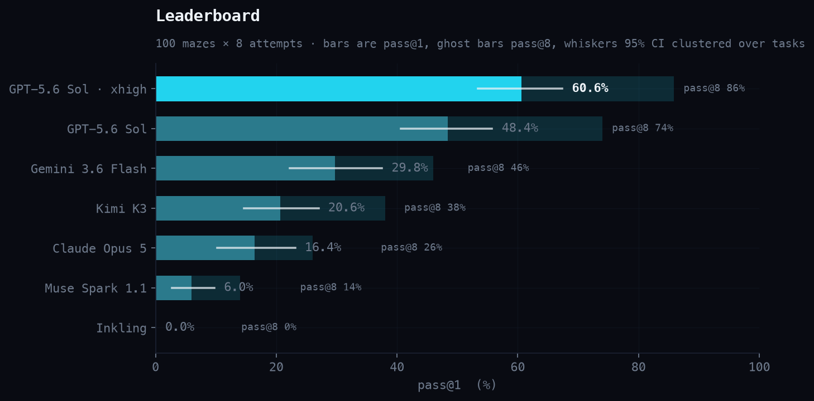
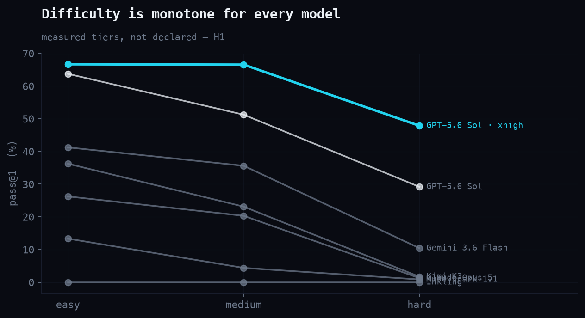
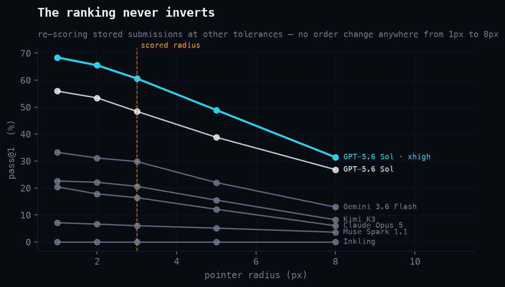
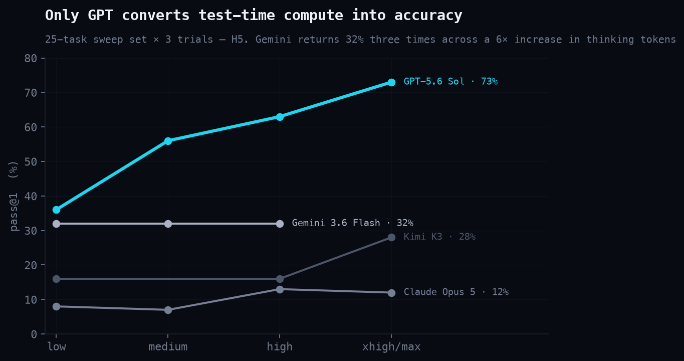
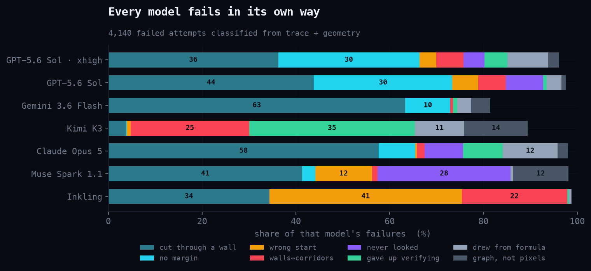
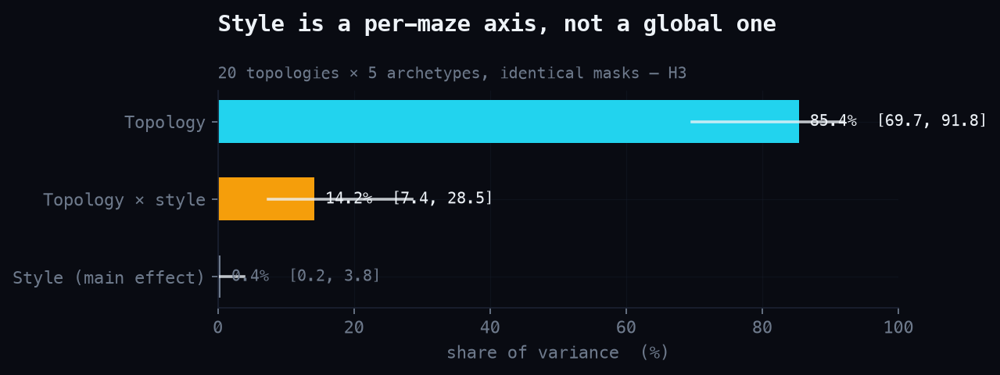
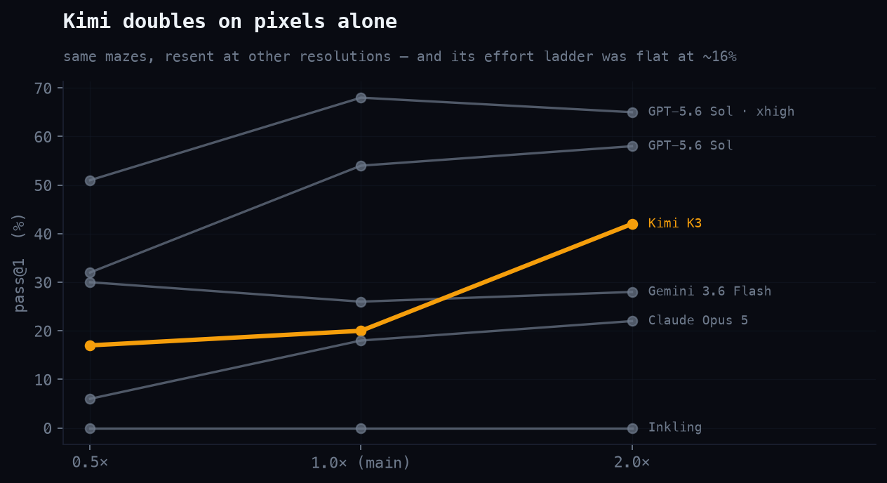
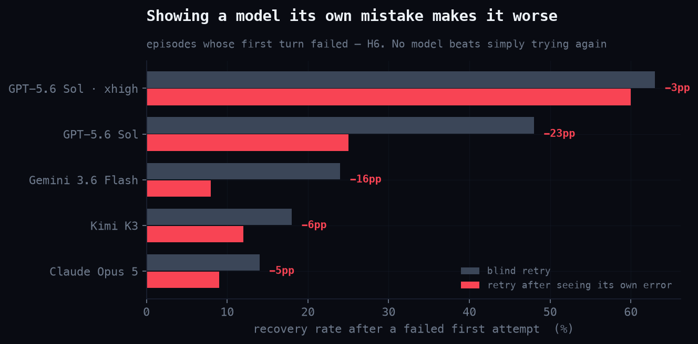
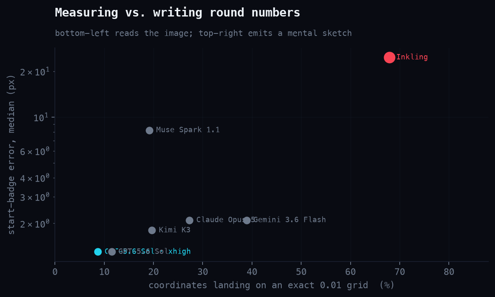

# MazeRunner

**A continuous-control benchmark for multimodal models, and what it found.**

A model is shown a rendered maze and must submit one continuous drag path from
a cyan start badge to an amber goal badge, as normalized coordinates, in a
single tool call. Scoring sweeps a 3-pixel pointer disk along the submitted
polyline against the same mask that stenciled the image. There is no grid, no
move vocabulary, no partial credit for a plan that reads well.

The task is deliberately trivial for a person and turns out to be hard for
every model tested. The best configuration solves 61% of mazes on a single
attempt; four of seven models sit below 21%.



---

## 1. Why this task

Existing maze work for language models is discrete: models emit `UP, LEFT,
DOWN` over a grid, or pick a cell from a token map. That measures search over a
symbolic structure the prompt already handed them. Grounding benchmarks go the
other way and score a single point or box, which measures localization without
any execution.

MazeRunner sits in the gap. The model must *perceive* a continuous structure
from pixels and *execute* a continuous trajectory through it, with a physical
success criterion. Three properties follow:

- **No symbolic shortcut.** Corridor width is real. A route that is
  topologically correct but two pixels off the centreline fails.
- **Failure is localized.** The scorer reports exactly where the pointer left
  the corridor, which makes failure analysis possible rather than anecdotal.
- **Difficulty is decomposable.** Topology and rendering style are generated
  independently, so "hard maze" and "hard picture" can be separated — and they
  behave very differently (§7).

---

## 2. Construction, and why you can trust the scores

The generator produces four artifacts per task from one seed: a latent world, a
deterministic solver route, an open-space mask, and a rendered PNG. The
**renderer paints corridors through the mask as a stencil**, so anything that
looks open is open by construction — a model can never be penalized for
trusting the picture.

Construction alone is not enough, so every task must also pass pixel-level
**fairness certification** before it enters the dataset:

- corridor boundaries are legible everywhere along the mask outline,
- no region resembling corridor fill exists outside the mask (no painted-on
  passage that isn't real),
- decoration inside a corridor never spans more than a third of its width,
- both badges have adequate local contrast.

Certification fails closed: a task that cannot pass has its style resampled up
to six times and is otherwise dropped, with every rejection logged. The scored
reference route is itself run through the scorer, so a task ships only if its
own solution passes.

Efficiency is measured against a **mask-certified geometric optimum** — the
shortest legal path for a pointer of the given radius, found by eroding the
mask and running Dijkstra over the legal-centre region — not against the
generator's graph route, which is an upper bound a good model can legally beat.

**Dataset:** 1,000 tasks across 8 topology families and 20 style archetypes,
split dev 200 / test-public 300 / test-hidden 500, with 6 archetypes and 8
family×archetype cells held out of the public splits. Every task records its
seeds, resolved parameters, certification metrics, and rejection history;
`dataset verify` rebuilds tasks from provenance and demands byte-identical
masks.

---

## 3. Protocol

The analysis plan was written and frozen before the main run, and every
subsequent departure is recorded as a dated amendment in `ANALYSIS_PLAN.md`.

| | |
|---|---|
| Task set | `evals/dev-eval-100.txt` — 100 dev tasks, ILP-selected for 12–13 per family, tiers 30/40/30, every archetype ≥6 |
| Dataset vs. study | the dataset is 1,000 tasks; **every number in this study is from the 100-task subset** (×8 trials). test-public (300) and test-hidden (500, encrypted) ship unevaluated, as headroom for future runs and contamination auditing |
| Design | uniform flat: every model × every task × exactly 8 trials |
| Prompt | frozen, dimension-free |
| Order | randomized per model leg, seed recorded |
| Reasoning | each model at its vendor default or ladder midpoint, verified from usage telemetry |
| Scale | 5,600 attempts |

Two headline metrics, never blended: **pass@1** (mean success per attempt,
macro-averaged over tasks) and **route progress** (fraction of the certified
route completed before failure). Confidence intervals resample *tasks*, not
attempts — eight attempts on one maze are not eight independent observations,
and resampling attempts would shrink intervals by roughly √8 and manufacture
significance.

Transport failures are excluded from denominators and requeued once; anything
still missing is listed in the run manifest.

---

## 4. Main result

| Model | pass@1 | 95% CI | pass@8 | Route progress |
|---|---|---|---|---|
| GPT-5.6 Sol @ xhigh | **60.6%** | [53.4, 67.4] | 86% | 0.719 |
| GPT-5.6 Sol @ medium | **48.4%** | [40.6, 55.8] | 74% | 0.612 |
| Gemini 3.6 Flash | **29.8%** | [22.2, 37.5] | 46% | 0.432 |
| Kimi K3 | **20.6%** | [14.6, 27.0] | 38% | 0.329 |
| Claude Opus 5 | **16.4%** | [10.2, 23.1] | 26% | 0.320 |
| Muse Spark 1.1 | **6.0%** | [2.8, 9.8] | 14% | 0.177 |
| Inkling | **0.0%** | [0.0, 0.0] | 0% | 0.029 |

Adjacent ranks separate on paired tests except **Kimi K3 vs Claude Opus 5**
(+4.2pp, CI spans zero, p=0.25) — those two are tied on pass@1, though McNemar
separates them on any-of-8 reliability (p=0.017).

Difficulty is monotone for every model across measured tiers, which is the
validity check the tiers exist for.



### The ranking is not an artifact of the scoring constant

Every score depends on the 3-pixel pointer. Re-scoring all 5,600 stored
submissions at radii from 1px to 8px produces **the identical ordering at every
tolerance**, with no inversions anywhere.



---

## 5. Test-time compute buys accuracy for one model and nothing for the others

Each model was swept across its own reasoning-effort ladder on a fixed 25-task
set, 3 trials per level.



Three regimes, not one curve:

- **Scaling (GPT-5.6 Sol).** Monotone, +37pp from low to xhigh, still climbing
  at the top of the ladder.
- **Threshold (Gemini 3.6 Flash).** Any thinking is worth +12pp over none; more
  thinking is worth nothing. Low, medium, and high each returned **exactly
  24/75** while reasoning tokens ran 2,385 → 8,135 → 14,607.
- **Flat (Claude Opus 5, Kimi K3).** Opus sits inside noise at every level
  while latency grows 6×. Kimi is flat from low to high, gaining only at max —
  at 9+ minutes per maze.

This is the study's most quotable finding and its most consequential one: the
same nominal knob produces a scaling curve, a step function, and a flat line on
identical tasks. "Reasoning effort" is not a comparable unit across vendors.

---

## 6. Why models fail — and why the answer differs per model

The scorer says *where* an attempt broke. To learn *why*, failure traces were
read across all seven models, ten recurring reasoning patterns were named, and
each was operationalized as a classifier rule requiring **both** a lexical cue
in the model's own trace **and** corroborating geometry from its submitted
path. Wording alone never assigns a cause: models narrate uncertainty they do
not act on, and act on confusions they never narrate.



| Model | Signature failure |
|---|---|
| GPT (both configs) | **Clearance, 30%** — centreline legal the entire way; the swept pointer still clips a wall |
| Gemini · Opus | **Wall-cutting, 63% / 58%** — commit to a route and drive it through a barrier |
| Kimi K3 | **Satisficing, 35%** — states the path is approximate, submits anyway. Only 4% wall cuts |
| Muse Spark | **Never looked, 28%** — traces with no coordinate, colour, or spatial reference at all |
| Inkling | **Entry-point failure** — 41% wrong start, 22% figure–ground inversion |

Some individual traces are worth reading in full. GPT-5.6 Sol talking itself
into an impossible route:

> *"there might be a hidden connection throughout the network using badge
> teleport … It looks like the entire wall network is likely interconnected, so
> this tube route could indeed be valid."*

Gemini asserting a verification it did not perform, on a path that collides:

> *"I checked all possible dead ends and verified the entire map structure."*

And Kimi declining to check at all:

> *"Does segment (0.500,0.335)->(0.545,0.385) cross gap? maybe central. Fine.
> … Final can be approximate."*

**Limits.** The largest bucket, "cut through a wall" (40%), is descriptive
residual rather than mechanism — it means the trace named no recognizable
cause. 20% of failures carry no trace at all (overwhelmingly Inkling, whose
provider returns reasoning intermittently) and are labelled on geometry alone;
every verdict records whether its evidence was `diagnostic`, `uninformative`,
or `absent`. Agreement with hand labels is 8/9 on the traces used to build the
taxonomy, which is a sanity check and not a measured accuracy.

### What actually predicts failure

A logistic regression of per-attempt success on the measured task features,
standardized, with task-clustered bootstrap CIs:

| Feature | All models | GPT @ xhigh | Gemini |
|---|---|---|---|
| normalized length | +0.18 | −0.19 | +0.62 |
| **turns** | **−0.72 \*** | −0.12 | **−1.70 \*** |
| **route branches** | **−0.19 \*** | +0.08 | **−0.67 \*** |
| **min clearance** | +0.19 | **+0.37 \*** | −0.14 |

**Turn count, not route length, makes a maze hard.** A long straight corridor
is easy; a short twisty one is not. Each turn is a place where the corridor must
be re-located, and errors compound there.

And the two strongest models are bound by *different things*: GPT's only
significant predictor is corridor **width** — it can follow any route but needs
room — while Gemini's are turns and branching, with clearance irrelevant. The
benchmark measures a different ability depending on where a model sits on it,
which is why a scalar score alone would mislead about *why* one model wins.

⚠️ This criticizes our own design: `difficulty_score` weights normalized
length, which does not predict success. Tiers remain monotone in observed pass
rate because the score is a blend, but a v2 difficulty model should down-weight
length in favour of turns and branching.

---

## 7. Ablations

Every ablation draws from `dev-eval-100`, so each attempt is paired with the
same task's main-run attempts.

### Vision validity — is it really reading *this* image?

**The intuition:** a model could score above zero without doing the task —
priors about where goals sit, geometry that "usually works." A blank canvas
measures that floor; *another maze's* image is the stricter probe, catching a
model that uses generic vision but not this picture.

25 tasks × 2 trials × 7 models × {blank canvas, another task's image}:
**0 passes in 700 scored attempts**, route progress ~0.000 throughout. Blind
failure is *total, not degraded* — 97% of attempts never begin on the start
badge, and **zero** reach a wall, because they never get far enough to collide.

This is a methods check rather than a discovery, but it is load-bearing: with
no prior-guessable floor, every leaderboard number is attributable to reading
the specific image, and Inkling's 0.0% and Muse's 6.0% are real measurements.

### Style vs topology

**The intuition:** every rendered benchmark entangles "is the structure hard?"
with "is the picture hard?" Because topology and rendering come from
independent seeds, the same maze can be re-painted over a byte-identical
scored mask — making the picture the only variable.

20 topologies rebuilt in 5 visual styles each, with byte-identical scored masks
asserted per group and the reference route re-verified under every rendering.



Averaged over mazes, style barely matters — a 6-point spread against a 92-point
topology spread. But the interaction is 14.2% [7.4, 28.5] against a style main
effect of 0.4% [0.2, 3.8], and **within a single fixed maze the best and worst
rendering differ by 24 points on average, up to 51**. Style is not a global
difficulty dial; it is a per-maze one. No archetype is uniformly harder.

A benchmark pairing one style to one maze would report that interaction as
topology difficulty.

### Input resolution

**The intuition:** vision encoders downsample, so a corridor a few pixels wide
may not survive into the model's internal representation at all — a failure no
amount of reasoning can fix. Resending the identical maze at 0.5× and 2×
isolates that channel. A model that improves with pixels but not with thinking
was perception-bound; a model stuck at zero at *every* resolution cannot blame
the encoder — its failure sits upstream of pixel budget.



**Kimi more than doubles at 2× resolution (20% → 42%)** while its effort ladder
was flat at ~16%. Extra reasoning bought it nothing; extra pixels bought it
everything. That dissociation is the sharpest evidence in the study that the
binding constraint is perceptual acuity rather than deliberation.

Halving resolution hurts nearly everyone (Opus 18→6%, GPT-medium 54→32%). Two
exceptions carry information: Gemini is flat across all three scales, and
**Inkling is 0% at every resolution** — which closes the loop on its diagnosis.
Its coordinate fingerprints (§8) show 68% of its outputs on an exact 0.01 grid
and 25px median start-badge misses, i.e. round numbers from a mental sketch;
this ablation rules out the charitable alternative that it simply couldn't see
fine detail. More pixels change nothing because it was not using the pixels.

### Closed-loop feedback

**The intuition:** the agentic-loop assumption is that showing a model its
error beats a fresh guess. This tests the cheapest version on a task where the
error is visually exact — no diagnosis required, only re-perception of one
marked location. If closed-loop correction works anywhere, it should work here.

Models were shown their own failed path drawn over the maze with a ⊗ at the
exact point they left the corridor, told only the failure category, and asked
again — up to four turns, stopping at first success. No oracle geometry.
These are true multi-turn conversations with the full history retained: at
turn 2 the context holds two images (the original maze plus the overlay of
attempt 1), at turn 3 three, and so on — verified from stored usage, where
input tokens grow monotonically per turn (e.g. 1.4K → 19K → 25K → 30K). The
original image is never dropped.



Restricted to episodes whose first turn failed — the only place feedback can
matter — **no model beats simply trying again blind.** GPT-medium is −24pp,
Gemini −16pp; the strongest configuration is statistically indistinguishable
from a fresh attempt.

The mechanism is visible in route progress, which *rises* after feedback (+0.15
to +0.58) while almost never converting to a pass: models repair locally toward
the marked collision point and then fail somewhere else. The overlay anchors
them to the failed route instead of prompting a fresh reading.

This tests one feedback design — the cheapest and most natural one. A richer
signal might do better. What these data rule out is that the obvious version
works.

### Dimension disclosure

**The intuition:** submissions are normalized, so the model must implicitly
know the canvas size to convert a measured pixel into a coordinate. Disclosure
removes that conversion step — so whether it helps or hurts localizes whether
a model's errors live in measurement or in normalization.

Telling the model the canvas size redistributes rather than lifts: GPT +8pp,
Gemini −8pp, Opus +2pp, netting ~zero — replicating a 25-task pilot within 1–4
points at n=100. The mechanism is specific: disclosure cuts **wrong-start
errors from 9% to 1%** while barely moving collisions (64%→60%). It repairs the
normalization step and does nothing for corridor tracing.

At GPT-xhigh the effect vanishes entirely (0pp) — enough reasoning establishes
scale from the image alone, making the disclosure redundant.

---

## 8. Fingerprints: measuring vs. writing round numbers



Two signatures separate a model reading the image from one emitting plausible
geometry. **Inkling places 67.9% of its coordinates on an exact 0.01 grid and
misses the start badge by 25 pixels at the median** — it is not looking at the
maze. GPT is the mirror image: irregular coordinates, 1.3px badge accuracy.

A subtler separation: **Gemini localizes better than GPT** (2.1px median, 4px
at p90 — a tighter tail than GPT's 15px) yet scores half as well. Finding where
things are and tracing a corridor between them are different abilities.

---

## 9. What this says

**The field is not saturated.** The best configuration fails 39% of single
attempts and 48% of hard-tier mazes on a task a person does without thinking.

**Reasoning effort is not a portable unit.** The same knob scales one model,
steps once for another, and does nothing for two more. Comparing "high effort"
across vendors is not comparing like with like.

**Perception, not planning, is the binding constraint for most of the field** —
and the evidence is convergent rather than a single test: the effort sweeps
(more thinking doesn't help), the resolution ablation (more pixels does), the
H1 regression (clearance and turns predict; length doesn't), and the trace
taxonomy (clearance failures, figure–ground inversions, models that never
looked).

**Self-correction from one's own error does not work here.** Every model was
better off resampling than reasoning about where it went wrong.

**Benchmarks that pair one rendering to one structure confound two axes.** The
style×topology interaction is 20× the style main effect; a fixed-style design
would silently attribute it to topology.

---

## 10. Reproducibility

Everything is regenerable from committed artifacts.

- **Dataset:** one master seed and `dataset.config.json` reproduce all 1,000
  tasks; `dataset verify` rebuilds from per-task provenance and requires
  byte-identical masks.
- **Task sets:** ILP-selected with recorded seeds; `evalset verify` re-solves
  and asserts identical ids and subset containment.
- **Runs:** every attempt records its run id, shard, ordinal, order seed, task
  directory, image variant, serving stack, and full retry history alongside the
  raw provider payload.
- **Archive:** every run ever executed — including voided legs and killed
  shards, retained as evidence rather than tidied away — is compressed and
  checksummed. `archive verify` re-hashes 12,460 files and distinguishes an
  appended-to snapshot from a rewritten one by content, not timestamp.
- **Analysis:** offline, no network, 255 tests.

Known deviations from the frozen plan, all recorded as dated amendments: Qwen3-VL
and GLM were dropped (not deployed with reasoning / text-only); the effort
sweeps and floor checks ran on a 25-task set that overlaps `dev-eval-100` by
only 14 of 25, so sweep↔main-run comparisons are **unpaired**; the Kimi `max`
sweep leg lost 15 of 75 attempts to timeouts and has uneven per-task coverage.

### Commands

```bash
uv run mazerunner dataset build && uv run mazerunner dataset verify
uv run mazerunner evalset build --out evals/dev-eval-100.txt --seed 20260730
uv run mazerunner run --config litellm.config.json --dataset datasets/v1/dev \
    --mazes-file evals/dev-eval-100.txt --trials 8 --run-id main --shard 0/6 --order-seed 20260730
uv run mazerunner merge --runs 'results/main/*/main/shard-*' --out results/main/merged
uv run mazerunner failuremodes
uv run python scripts/make_figures.py
uv run mazerunner archive build && uv run mazerunner archive verify
```

### Companion documents

| File | Contents |
|---|---|
| `ANALYSIS_PLAN.md` | the frozen plan and every dated amendment |
| `results/main-run-leaderboard.md` | main run, tiers, taxonomy |
| `results/effort-sweeps.md` | all four effort ladders, with per-provider knob verification |
| `results/ablations.md` | five ablations in full |
| `results/analysis.md` | statistics, tolerance curves, fingerprints, economics |
| `results/failure-modes.md` | the taxonomy, worked examples, and its limits |
| `results/failure-modes.jsonl` | one verdict per failed attempt, with evidence |
